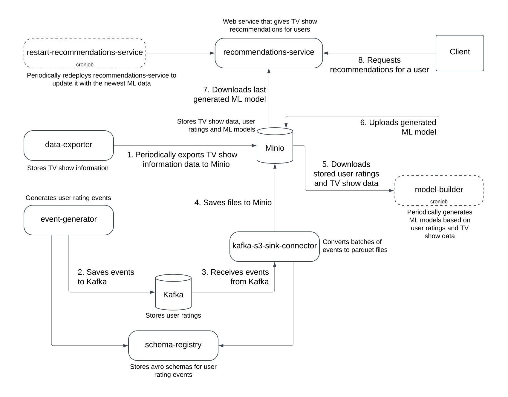

# 📺 TV Show Recommendation System

This project implements a machine learning-based recommendation system for TV shows using a microservices architecture, real-time event processing, and container orchestration with Kubernetes.

---

## 🧩 System Overview

- **`data-exporter`**  
  Periodically exports TV show metadata to object storage (MinIO).

- **`event-generator`**  
  Continuously generates user rating events and sends them to Apache Kafka.

- **`Kafka + Kafka S3 Sink Connector`**  
  Consumes rating events and stores them in batches in MinIO.

- **`model-builder`**  
  Runs every 2 minutes, downloads user ratings and TV show metadata from MinIO, trains a machine learning model, and uploads the latest model back to MinIO.

- **`recommendations-service`**  
  Loads the latest model from MinIO and provides REST API for TV show recommendations.

---

## 🔧 Technologies Used

- **Python**, **Kotlin**
- **Kubernetes**, **Helm**
- **Apache Kafka**, **Schema Registry**, **S3 Sink Connector**
- **MinIO**
- **lightfm**

---

## 📐 Architecture Diagram
